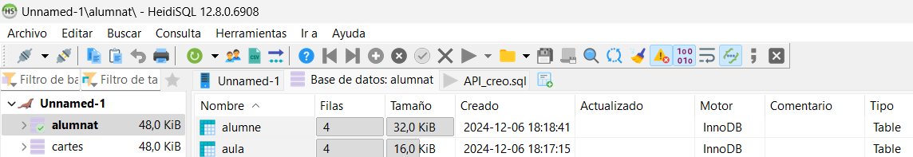
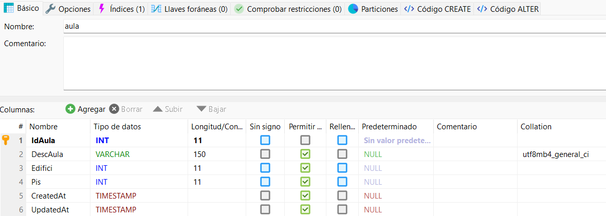
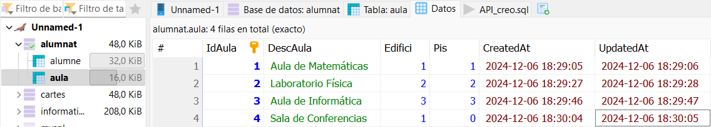
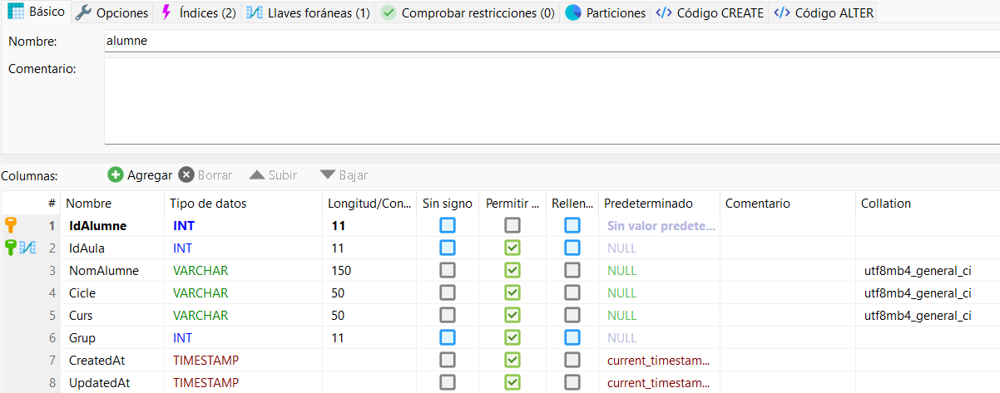
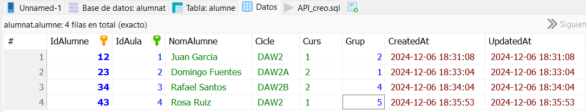

# PROJ_AC1_API

## Base de datos "Alumnat"

En primer lugar hemos creado una base de datos utilizando HeidiSQL. Esta base de datos tiene el nombre de "Alumnat" y cuenta con dos tablas: "Aula" y "Alumne".

## Tabla "Aula"

Columnas de la tabla "Aula":

Como se puede apreciar en la siguiente captura, "IdAula" es la clave primaria de esta tabla.

Datos de "Aula":

En esta imagen podemos ver los datos de "Aula", que han estado introducidos de forma manual.

## Tabla "Alumne"

Columnas de la tabla "Alumne":

En la siguiente imagen podemos ver que "IdAlumne" es la clave primaria y "IdAula" es la clave foranea.

Datos de la tabla "Alumne":

Aqui podemos ver los datos que hay, que tambien han sido puestos de manera manual.

